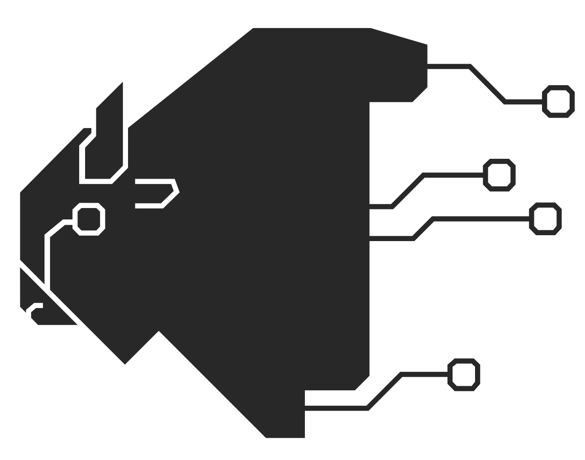
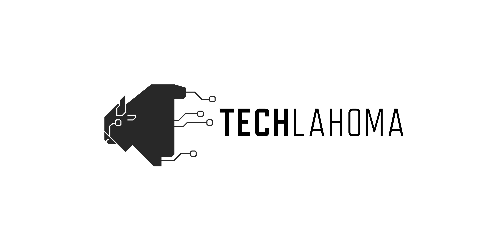
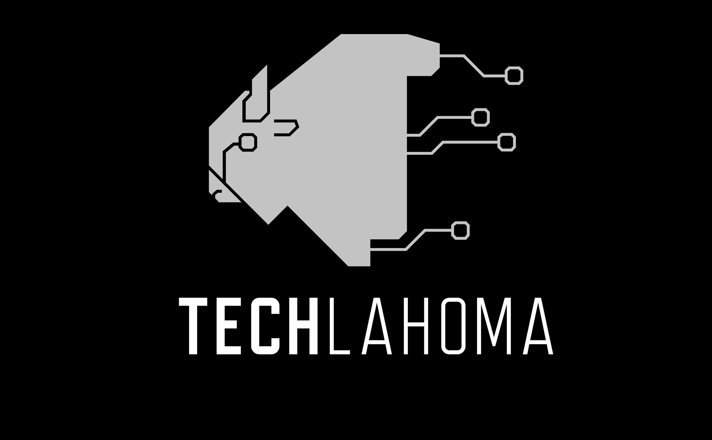

# Techlahoma Assets
---

##Techlahoma
###Json the Bson

##### Head above Text - Square

##### Head Only - Square

##### Full Body - Square

##### Banner - Horizontal

##### Inverted, Wallpaper

##Conferences
###Thunder Plains
#### Lightning Tag

#### Shield
##### Clear back

##### Blue Back

##Usergroups

###OKC Ruby
#### Official Logo 

###OKC.js
#### Official Logo

##Techlahomies!

